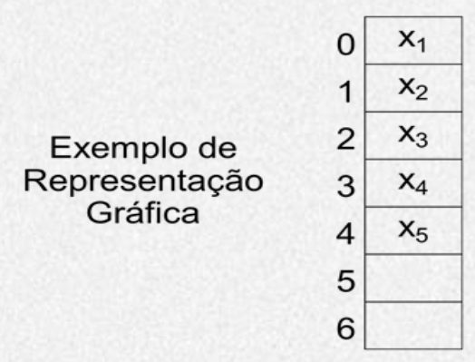
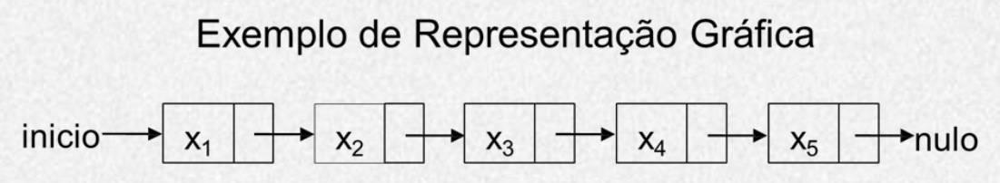
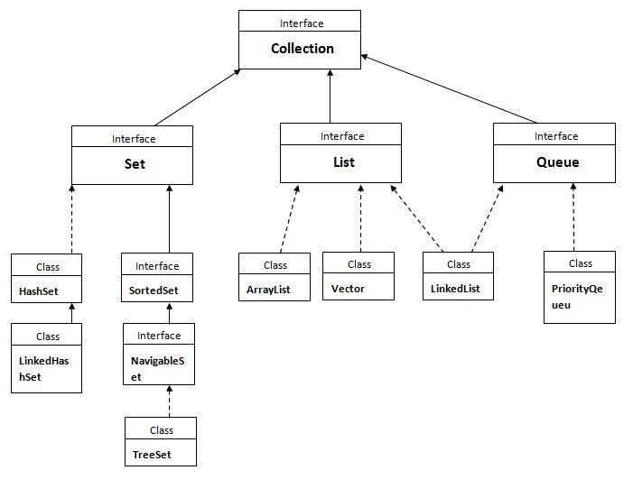
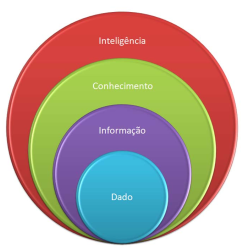
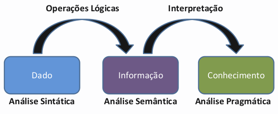
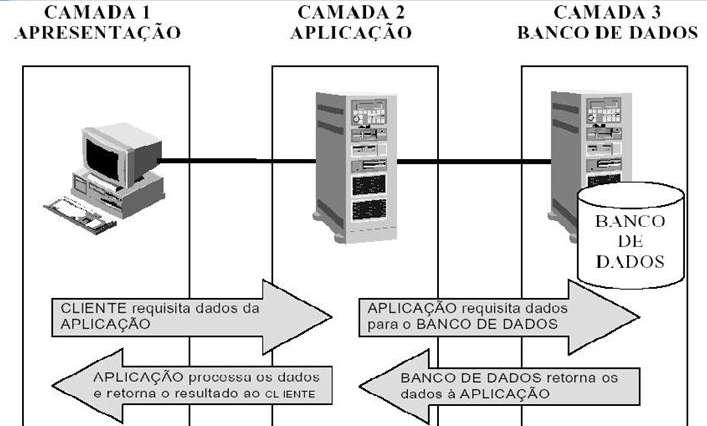

# Resumo ADS4

## Semana 01

* **TAD** → Tipo Abstrato de Dados
  * *Lista, fila, pilha, árvores, grafos*

* **ED** → Estrutura de Dados → Forma de implementar computacionalmente uma TAD. Pode ser sequencial ou encadeada
  * *map, set*


| Sequencial                         | Encadeada                          |
| ---------------------------------- | ---------------------------------- |
|  |  |


* **Algoritmos** → Conjunto de regras e procedimentos lógicos que levam a solução de um problema

* **Modularização** → Quebrar o problema em pequenas partes, ou seja, criar subprogramas


#### Recursão

* Repetição de tarefas sem uso de estruturas de repetição (for/while/do...while), chamando recursivamente o mesmo a própria função
* Deve ter uma base de parada
* Muito utilizado em problemas de dividir e conquistar


###### n! [fatorial]

```java
public static int fat(int n){
   if(n ==0) return 1; // base ou ponto de parada
   return n*fat(n-1);
}
```


###### Fibo(n) [Fibonacci]

```java
public static int Fibo( int n){
   if(n== 0) return 0;
   if (n==1) return 1;
   return Fibo (n-1) + Fibo(n-2);
}
```


---


## Semana 02

*Sem aula*


---


## Semana 03

*Sem aula*


---


## Semana 04

→ **Interface Gráfica do Usuário** (Java): AWT, Swing JavaFX

#### Swing

* **JFrame** → Representação de uma janela
  * Outros elementos vão dentro dele
* **JPanel** → Organiza os componentees dentro do JFrame
* **JLabel** → Rótulo de texto ou imagem
* **JTextField** → Campo de texto (para entrada do usuário)
* **JPasswordField** → Campo para digitação de senha ( :warning: retorna um char[] )
* **JButton** → Botão, pode receber dentro texto, ícone ou ambos
* **JTextArea** → Área de texto com múltiplas linhas
* **JFormattedTextField** → Entrada de texto formatado (com máscara)
* **JCheckBox** → Caixa de seleção (jchekbox.isSelected() → retorna true/false)
* **JRadioButton** → Caixa de seleção rádio, deve fazer parte de um ButtonGroup
* **JComboBox** → Lista de itens drop-down (jcombobox.getSelectedIndex() → retorna posição selecionada)
* **JList** → Lisita (não drop-down)

```java
import javax.swing.*;

public class Main {
  
  JFrame janela = new JFrame("Nome da Janela");
    
  JLabel rotulo = new JLabel();
  rotulo.setText("Nome:");
  rotulo.setIcon("caminho/do/arquivo.png")

  JTextField texto = new JTextField();
  texto.setText("Andrey Masiero");
  texto.getText() // Obtém o valor digitado no campo

  JPasswordField senha = new JPassowordField();
  // Obter o valor digitado e converter para String:
  String senha = new String(campo.getPassword());

  // Criar um campo com máscara CEP:
  String mascara_cep = "#####-###";
  MaskFormatter formato_cep = createFormatter(mascara_cep);
  JFormattedTextField cep = new JFormattedTextField(formato_cep);
  
  // Monta e exibe janela:
  janela.add(rotulo);
  janela.add(texto);
  janela.add(senha);
  janela.add(cep);
  janela.setVisible(true);
    
}

```

<pre>
<b>Char Descrição</b>
 <b>#</b>   Número
 <b>U</b>   Qualquer caractere, trans. p/ MAIÚSCULAS
 <b>L</b>   Qualquer caractere, trans. p/ minúsculas
 <b>A</b>   Caractere ou número
 <b>*</b>   Qualquer coisa
</pre>


#### Conversão de String para Tipos Primitivos

```java
Double.parseDouble("1.99")
Float.parseFloat("45.2")
Integer.parseInt("3")
"string".charAt(n) //Obtem char na posicao n do string
```


#### Evento

```java
// Adiciona um listener ao evento "fechar":
fechar.addActionListener(new ActionListener() {
   public void actionPerformed(ActionEvent evt) {
      fecharActionPerformed(evt);
   }
});
private void fecharActionPerformed(ActionEvent evt) {
   System.exit(0);
}
```


---


## Semana 05

### API Collections

* Substitui vetor tradicional
* Dinâmico
* Recomendado implementar o método mais genérico, por exemplo:
  * *Collection\<String> viajantes = new HashSet<>()* ao invés de *Set\<String> viajantes = new HashSet<>()*




#### ArrayList

→ Classe mais conhecida

```java
import java.util.*;

ArrayList<String> textos = new ArrayList<>(); // Cria
textos.add("Exemplo de texto"); // Adiciona
textos.add("Outro exemplo");

textos.size(); // retorna tamanho array
textos.get(1); // recupera índice 1
textos.remove(1); // remove indice 1

// 2 formas de percorrer lista:
for (String texto : textos) {}; // for each loop
textos.forEach(texto -> funcao(texto)); // for each inline (lambda/java 8)

Collections.sort(lista); // ordenação

```


&rarr; Implementando em um objeto

```Java
public class Objeto implements Comparable(Objeto) {
    
    String atributo1;
    int atributo2;
    
    public Objeto(String atributo1, int atributo2) { ... }
    
    @Override
    public String toString() {
        return atributo1 + ", " + atributo2 // retorno chamada ArrayList
    }
    
    @Override
    public int compareTo(Objeto x){ // implementa Collections.sort 
        return this.atributo1.compareTo(x.atributo1); // para String ou:
        return this.atributo1 - x.atributo 1; // para Int, float...
    }
}
```

```java
public static void main(String[] args){
    ArrayList<Objeto> objetos = new ArrayList;
    objetos.sort(objetos));
}
```


#### Set e HashSet

→ Objetos não possuem ordem, simplesmente armazena os objetos

→ Para percorrer os objetos pode-se utilizar um *for each*, pois não possui método *get*

→ Não permite objetos iguais no conjunto

→ Método *contains* muito mais rápido quando executado em HashSet:

<blockquote> O contains da ArrayList faz uma busca linear, já o HashSet utiliza uma tabela de espalhamento para tentar fazer a busca em tempo constante</blockquote>


---


## Semana 06

#### AbstractTableModel

* javax.swing.table.AbstractTableModel
* Métodos para sobrescrever:
  * public int getRowCount();  &larr; obrigatório
  * public int getColumnCount();  &larr; obrigatório
  * public Object getValueAt(int linha, int coluna); &larr; obrigatório
  * public String getColumnName(int coluna);


→ Implementação Negócio:

```java
import javax.swing.*;
import java.util.*;

public class ModeloUsuario extends AbstractTableModel {
    
    List<Usuario> usuarios = new ArrayList<>();
    // usuarios possui nome e login
    
    @Override
    public int getRowCount() {
        return usuarios.size();
    }

    @Override
    public int getColumnCount() {
        return 2;
    }

    @Override
    public Object getValueAt(int rowIndex, int columnIndex) {
        Usuario u = usuarios.get(rowIndex);
        switch(columnIndex){
            case 0:
                return u.getNome();
            case 1:
                return u.getLogin();
            default:
                return null;
        }
    }
    
    @Override
    public String getColumnName(int columnIndex){
        switch(columnIndex){
            case 0:
                return "Nome";
            case 1:
                return "Login";
            default:
                return null;
        }
    }
}
```


→ Implementação SWING:

```java
import javax.swing.*;
import ModeloUsuario;

public class MainWindow extends javax.swing.JFrame {
    
  public void adicionar(Usuario u) {
    usuarios.add(u);
    fireTableRowsInserted(usuarios.size()-1, usuarios.size()-1);
  }
  
  public void remover(int linha) {
    usuarios.remove(linha);
    fireTableRowsInserted(usuarios.size()-1, usuarios.size()-1);
  }
    
  private void tabelaUsuariosMouseClicked(MouseEvent evt) {
    Usuario u = tabela.getUsuario(tabelaUsuario.getSelectedRow());
    nome.setText(u.getNome());
    senha.setText(u.getSenha()));
  }
      
  public static void main(String args[]){
       JTable tbl_usuario = new JTable(); // Cria tabela
      
       ModeloUsuario modeloUsuario = new ModeloUsuario();
       tbl_usuario.setModel(modeloUsuario); // Define o modelo da tabela
  }
    
}
```


#### Conectar JDBC

```java
import java.sql.Connection;
import java.sql.DriverManager;
import java.sql.SQLException;

public class DAO {
    public static Connection conectar(){
        Connection conn = null;
        try {
            Class.forName("oracle.jdbc.driver.OracleDriver");
            conn = DriverManager.getConnection("jdbc:oracle:thin:@localhost:1521:XE", "system", "oracle");
        } catch (ClassNotFoundException ex) {
            ex.printStackTrace();
        } catch (SQLException ex){
             ex.printStackTrace();
        }
        return conn;
    }
    
    public static void desconectar(Connection conn){
        try {
            if (conn != null) conn.close();
            System.out.println("Desconectou");                    
        } catch (SQLException ex) {
            ex.printStackTrace();
        }
    }
}
```


&rarr; Carregando informações do banco de dados:

```java
    public List<Usuario> carregar(){
        List<Usuario> usuarios = new ArrayList();
        Connection conn = DAO.conectar();
        try {
            String sql_consulta = "Select * from controlelivro_usuario";
            PreparedStatement stmt = conn.prepareStatement(sql_consulta);
            ResultSet rs = stmt.executeQuery();
            while(rs.next()){
                usuarios.add(new Usuario(
                        rs.getInt("id"),
                        rs.getString("nome"),
                        rs.getString("login"),
                        rs.getString("passwd")
                ));
            }
        } catch (SQLException ex) {
            ex.printStackTrace();
        } finally {
            DAO.desconectar(conn);
        }
        return usuarios;
    }
```


---


## Semana 07

#### Pilha e Fila

* São conjuntos dinâmicos para armazenar informações;
* A informação removida é especificada previamente a sua implementação


#### Pilha 

&rarr; LIFO (last in, first out - primeiro a entrar, último a sair

* push &rarr; empilhar

```java
public void push(Object valor) {
	topo = topo + 1;
	pilha[topo] = valor;
}
```

* pop &rarr; desempilhar

```java
public Object pop() {
	topo = topo - 1;
	return pilha[topo + 1];
}
```

* top &rarr; valor no topo

```java
public Object top() {
	return pilha[top];
}
```

* isEmpty

``` java
public boolean isEmpty() {
	return topo == 0;
}
```

 

#### Fila 

&rarr; FIFO (first in, first out - primeiro a entrar, primeiro a sair)

* enqueue 

```java
public void enqueue(Object valor) {
	fila[fim] = valor;
	if (fim = tamanho)
		fim = 0;
	else
		fim = fim + 1;
}
```

* dequeue

```java
public Object dequeue() {
x = fila[inicio];
	if (inicio == tamanho)
		inicio = 0;
	else
		inicio = inicio + 1;
	return x;
}
```

* front

```java
public Object front() {
	return fila[inicio];
}
```

* isEmpty

```java
public boolean isEmpty() {
    return (inicio == 0) && (fim == 0);
}
```


#### Lista

&rarr; Elementos são recuperados, adicionados ou removidos em qualquer posição

* add

```java
void add(int value) {
	if (size < capacidade) {
		data[size] = value;
		size = size + 1;
	}
}
```

* remove

```java
void remove(int index) {
	if (size > 0) {
		if (index < size) {
			for(int i = index; i < size; i++) {
			data[i] = data[i + 1];
		}
		size = size - 1;
		}
	}
}
```

* get

```java
int get(int value) {
	for(int i = 0; i < size; i++) {
		if(data[i] == value) {
		return i;
		}
	}
	return null;
}
```

* size

```java
int size() {
	return size;
}
```

* isEmpty

```java
boolean isEmpty() {
	return size == 0;
}
```


#### Busca Sequencial

&rarr; Busca de elemento a elemento

→ Complexidade: O(n)

```java
vetor[10] = {31, 16, 45, 87, 37, 99, 21, 43, 10, 48}
valorProcurado = 87
indice = -1
for (i = 0; i < vetor.length - 1; i++) {
	if (vetor[i] == valorProcurado) {
	indice = i
	}
}
```


#### Busca Binária

&rarr; Somente em vetor ordenado

→ Complexidade: O(log n)

&rarr; Encontrar posição central (posição incial + final)/2

​	&rarr; Caso encontrado, retorna

​	&rarr; Caso valor procurado maior, refaz loop centro+1

​	&rarr; Caso valor procurado menor, refaz loop centro -1

```java
vetor[10] = {10, 16, 21, 31, 37, 43, 45, 48, 87, 99}
inicio = 0;
fim = vetor.length - 1;
centro;
do{
	centro = inicio + (fim - inicio)/2;
	if(x < vetor[centro])
		fim = centro - 1;
	else if(x > vetor[centro])
		inicio = centro + 1;
	else return centro;
}while(inicio <= fim);
```


#### Complexidade

Do menos complexo para o mais complexo na notação Big O:

* **O(log (*n*))**  → Logarítmica
* **O(*n*)** → Linear
* **O(*n* log (*n*))**  → Logarítmica Linear
* **O(n<sup>2</sup>)**  → Quadrática
* **O(2<sup>n</sup>) **→ Exponencial
* **O(*n!*)** → Fatorial


---


## Semana 8

#### Bubble Sort

* Mais fácil de implementar
* Pior complexidade O(n²)

```java
public void ordenar(int[] dados){
	for (int i=0; i<dados.length; i++){
		for (int j=0; j<dados.length-1; j++){
			if (dados[j]>dados[j+1])
				trocarPosicao(dados, j, j+1);
		}
	}
}

private void trocarPosicao(int[] dados, int j, int i) {
	int auxiliar = dados[i];
	dados[i] = dados[j];
	dados[j] = auxiliar;
}
```


#### Selection Sort

* Busca menor elemento e posiciona na primeira posição;
* Realiza novamente até n-1;
* Complexidade O(n²)

 ```java
public void ordenar(int[] dados) {
	for (int i=0; i<dados.length; i++) {
		int indice_menor = i;
		for (int j=i+1; j<dados.length; j++) {
			if (dados[j]<dados[indice_menor]) {
				indice_menor = j;
			}
		}
		trocarPosicao(dados, i, indice_menor);
	}
}
 ```


#### Insertion Sort

* Utiliza um vetor auxiliar;
* Elementos inseridos na posição correta;
* Complexidade O(n²)

```java
public void ordenar(int[] dados) {
	for (int i=0; i<dados.length; i++) {
		int a = dados[i];
		for (int j = i-1; j>=0 && dados[j]>a; j--) {
			dados[j+1] = dados[j];
			dados[j] = a;
		}
	}
}
```


#### MergeSort

* Recursivo - Dividir e Conquistar;
* Vetor é dividido ao meio até que existam apenas pares de elementos;
* Cada par é ordenado e depois agrupados e ordenados em quatro elementos;
* Complexidade n*Log(n)

```java
public void ordenar(int[] dados, int inicio, int fim){
	if (inicio < fim) {
		int meio = (inicio + fim) / 2;
		this.ordenar(dados, inicio, meio);
		this.ordenar(dados, meio + 1, fim);
		this.mesclar(dados, inicio, meio, fim);
	}
}

private void mesclar(int[] dados, int inicio, int meio, int fim) {
	int i, esquerda, direita;
	int auxiliar[] = new int[dados.length];
	for (i = inicio; i <= fim; i++) {
		auxiliar[i] = dados[i];
	}
	esquerda = inicio;
	direita = meio + 1;
	i = inicio;

	while (esquerda <= meio && direita <= fim) {
		if (auxiliar[esquerda] <= auxiliar[direita]) {
			dados[i++] = auxiliar[esquerda++];
		} else {
			dados[i++] = auxiliar[direita++];
		}
	}

	while(esquerda <= meio) {
		dados[i++] = auxiliar[esquerda++];
	}
}
```


#### QuickSort

* Melhor e mais rápido algoritmo;
* Divisão e Conquista

```java 
public void ordenar(int[] dados, int inicio, int fim) {
	if (inicio < fim) {
		int pivo = this.dividir(dados, inicio, fim);
		this.ordenar(dados, inicio, pivo - 1);
		this.ordenar(dados, pivo + 1, fim);
	}
}

private int dividir(int[] dados, int inicio, int fim) {
	int pivo = dados[inicio];
	int posPivo = inicio;
	for (int i = inicio + 1; i <= fim; i++){
		if (dados[i] < pivo) {
			dados[posPivo] = dados[i];
			dados[i] = dados[posPivo + 1];
			posPivo++;
		}
		dados[posPivo] = pivo;
	}
	return posPivo;
}
```


---


## Semana 09

#### Sistema Gerenciador de Banco de Dados - SGBD

* Incorpora as funções de:
  * **Definição** (Estrutura, forma como dados estão estruturados)
  * **Recuperação** (leitura do dado que está armazenado) e alteração de dados
    * Acesso
    * Segurança
    * Rede
    * Espaço Físico
  * **Alteração**
* Facilita desenvolv. de aplic. BD:
  * Manutenção mais simples
  * Produtividade aumentada

##### Níveis de abstração

* Modelo Conceitual (maior abstração)
  * Nada técnico
  * Linguagem humana
* Modelo Lógico
  * Mais técnico
  * Linguagem proxima máquina
* Modelo Físico (menor abstração)
  * Totalmente técnico
  * Linguagem de máquina


##### Linguagem para Banco de Dados Relacional

3 grupos:

* **DDL**, Data Description Language
  * Comandos para construir/alterar estrutura
* **DML**, Data Manipulation Language
  * Manipulação de dados (alterar, incluir, eliminar informações)
* **DCL**, Data Control Language
  * Controle (usuários, acessos, segurança)


#### DDL

Criar, alterar e eliminar todos os objetos do BD:

* Tabelas e colunas
* Propriedades
* Relacionamentos
* Triggers


##### Tipos de Dados

* CHAR(size), VARCHAR2(size) &larr; Alfanuméricos
* NUMBER, NUMBER(precision, scale) &larr; Números inteiros ou decimais
* DATE &larr; Data ou Data e Hora 


##### Comandos Fundamentais

* CREATE
* DROP
* ALTER


Exemplo:

*Departamento (Codigo<sup>(1,1)</sup>, Nome_depto)*

*Empregado (Codigo, Nome, Dt_Nasc, Funcao, Cod_depto<sup>(0,N)</sup>)*

```sql
CREATE TABLE DEPARTAMENTO (
	CODIGO NUMBER(5),
	NOME_DEPTO VARCHAR2(20)
);

-- Alterar tabela, no caso adicionar chave primária:
ALTER TABLE DEPARTAMENTO
ADD CONSTRAINT PK_CODIGO PRIMARY KEY (C0DIGO)

CREATE TABLE EMPREGADOS (
	CODIGO NUMBER(10),
	NOME VARCHAR2(40),
	DT_NASC	DATE,
	FUNCAO VARCHAR2(20),
	COD_DEPTO NUMBER(5)),
	CONSTRAINT PK_CODIGO_EMP PRIMARYKEY(CODIGO),
	CONSTRAINT FK_DEPTO FOREIGN KEY(COD_DEPTO) REFERENCES DEPARTAMENTO(CODIGO)
);

-- Constraint: restrição de integridade

CREATE TABLE PRODUTO (
	CODIGO NUMBER(5) PRIMARY KEY,
	DESCRICAO VARCHAR2(20) NOT NULL,
	PRECO NUMBER(10,2),
	CONSTRAINT VERIFICA_PRECO CHECK (PRECO>0) // Verifica essa condição
)
```


---


## Semana 10

#### DML

→ Leitura e manipulação de informações armazenadas no Banco de Dados

##### SELECT

Recuperar informações armazenadas;

``` sql
SELECT COLUNA1, COLUNA2, COLUNA3
FROM TABELA1

SELECT NOME, (SALARIO*12) -- Manipula os dados apresentados da coluna salario:
FROM EMPREGADOS 

SELECT NOME, (SALARIO*12) AS SALARIO ANUAL -- Apelida segunda coluna
FROM EMPREGADOS

SELECT DISTINCT COD_DEPTO -- Mostra apenas valores distintos, suprimindo repetições
FROM EMPREGADOS

SELECT *
FROM EMPREGADOS
WHERE SALARIO > 9000; -- filtra salario maior que 9000
```

&rarr; Condições de comparação

* = > >= < <= <>
* BETWEEN ... AND ...
* IN (item1, item2, item3 ...)
* LIKE
* IS NULL
* WHERE

&rarr; Condições Lógicas

* AND
* OR
* NOT

```SQL
SELECT NOME, SALARIO
FROM EMPREGADOS
WHERE CODCHEFE IS NOT NULL
AND (SALARIO BETWEEN 9000 AND 12000)
ORDER BY NOME DESC; -- Ordena por nome ordem decrescente
```

&rarr; Funções de grupo

* GROUP BY
* AVG
* COUNT
* MAX
* MIN
* SUM

``` SQL
SELECT COD_DEPTO,
	AVG(SALARIO),
	MAX(SALARIO),
	MIN(SALARIO),
	SUM(SALARIO),
FROM EMPREGADOS
GROUP BY COD_DEPTO; -- Mostra media, maximo, minimo, soma dos salarios agrupados por depto


```


##### INSERT

``` SQL
INSERT INTO DEPARTAMENTO (CODIGO, NOME_DEPTO, LOCALIZACAO)
VALUES (50, 'TREINAMENTO', 'SEDE');

INSERT INTO DEPARTAMENTO_BACKUP (CODIGO, NOME_DEPTO, LOCALIZACAO)
SELECT * FROM DEPARTAMENTO; // COPIA DA TABELA DEPARTAMENTO PARA DEPARTAMENTO_BACKUP
```


##### UPDATE

```SQL
UPDATE EMPREGADOS
SET SALARIO = SALARIO * 1.10; // Atualiza todas as linhas da tabela

UPDATE EMPREGADOS
SET SALARIO = SALARIO * 2
WHERE CODIGO = 6; // Atualiza apenas a linha especificada
```


##### DELETE

```SQL
DELETE EMPREGADOS; // Deleta tudo (!)

DELETE EMPREGADOS
WHERE CODIGO = 1; // Deleta apenas a linha selecionada
```


#### Conversão de tipos

&rarr; TO_CHAR (DADO, 'FORMATO')

&rarr; TO_DATE 

&rarr; TO_NUMBER

###### Datas

Formatos

* YYYY
* YEAR 
* MM
* MONTH
* MON
* DY
* DAY
* DD

Operações

* ADD_MONTHS(DATA, N)
* MONTHS_BETWEEN(DATA1, DATA2)
* NEXT_DAY(DATA, 'DIA DA SEMANA')
* LAST_DAY(DATA)

```sql
SELECT NOME, TO_CHAR(DT_NASC, 'DD/MONTH, DAY')

INSERT INTO EMPREGADOS (CODIGO, NOME, DATA_NASC)
VALUES (9, 'RIVALDO DA SILVA' TO_DATE('14/04/1983', 'DD/MM/YYY'));
```

###### Números

Formatos

* 9 - representa um número
* 0 - Força exibição zero
* $ - Coloca símbolo dolar flutuante
* L - Símbolo moeda local flutuante
* . - imprime vírgula decimal
* , - imprime indicador de milhar

Operações

* ROUND(45.9269, 2) &rarr; 45.93
* TRUNC(45.9269, 2) &rarr; 45.92
* MOD(1600, 300) &rarr; 100 (resto divisão)

```sql
SELECT NOME, TO_CHAR(SALARIO, 'L999,999.99')
FROM EMPREGADOS;
```

###### Caracteres

* LOWER - caixa baixa
* UPPER - caixa alta
* INITCAP - capitializado
* CONCAT('Hello', 'World') &rarr; HelloWorld
* SUBSTR('HelloWorld', 1,5) &rarr; Hello
* LENGHT('HelloWorld') &rarr; 10
* INSTR('HelloWorld', 'W') &rarr; 6
* LPAD(SALARIO, 10, 'X') &rarr; XXXXXX24000
* RPAD(SALARIO, 10, 'X') &rarr; 24000XXXXXX
* TRIM('H' FROM 'HelloWorld') &rarr; elloWorld


#### JOIN

```SQL
SELECT EMP.NOME, DEP.NOME
FROM EMPREGADOS EMP
INNER JOIN DEPARTAMENTO DEP
ON EMP.COD_DEPTO = DEP.CODIGO;
```


---


## Semana 11

*Sem aula*


---


## Semana 12

* **Dado** &rarr; sequência de símbolos quantitativos qualificáveis, sem significado específico
* **Informação** &rarr;  resultado da organização, tratamento e interpretação de conjunto de dados estruturados
* **Conhecimento** &rarr; capacidade de analisar/interpretar diversos conjuntos de informação

|                                    |                                    |
| ---------------------------------- | ---------------------------------- |
|  |  |

* **Inteligência** &rarr; uso do conhecimento com competência em um processo de decisão

* **Business Intelligence** &rarr; utilização de variadas fontes de informação para definir estratégias de competitividade nos negócios


#### Data Warehouse / Data Marts

Forma de armazenar os dados históricos com uma arquitetura própria para análises (Data Warehouse/Data Marts) que permite:

* análises rápidas
* análises que sejam corretas
* fáceis de serem acessadas


##### Data Warehouse (DW)

* Banco de dados orientado por assunto
* Consolidador de dados, muitas vezes agregados
* Objetivo dar suporte aos processos de tomada de decisão
* Dados de toda a empresta


##### Data Marts (DM)

* Variante do Data Warehouse
* Voltado para área específica
* Restrição de assuntos


##### ODS - Operational Data Store

* tabela que segue uma estrutura de dados normalizada
* já realizado processo de limpeza de dados
* transição entre banco de dados transacional e data warehouse


##### Características de DW/DM

* **orientado por temas** - armazena informações sobre temas específicos e importantes para tomada de decisão
* **integrado** - recebe dados de diversas fontes. Necessário utilizar técnicas de limpeza e integração
* **variável no tempo** - não atualizável, cada ocorrência uma nova entrada é criada, a cada mudança uma nova entrada é criada
* **não volátil** - valores não podem ser alterados após inseridos


##### Granularidade

* Nível de detalhe em que as informações inseridas podem ser alcançadas (ex. diário, mensal, anual)
* maior granularidade &rarr; maior nível de detalhe &rarr; maior volume dados e menor performance


##### Tipos de concepção de um DW

A construção pode acontecer de duas formas:

* **Top-Down**:
  * Data Warehouse (corporativo) &rarr; Data Marts (departamentais)

* **Bottom-Up**
  * Data Marts &rarr; Data Warehouse


##### Fases de um projeto de DW/DM

- Planejamento
- Levantamento de Necessidades
- Modelagem Dimensional
- Projeto Físico do Banco de Dados
- Projeto de ETL (Extraction, Transformation and Loading)
- Desenvolvimento da Apresentação dos Dados (Relatórios/Painéis de Indicadores)
- Validação e Teste
- Treinamento de Usuários
- Implantação


#### Modelagem Dimensional

Estrutura de Modelagem de Banco de Dados própria para Business Intelligence

* Formato estruturado leve/limpo
* Intuito/simples entendimento
* Alto desempenho


<u>Dois tipos de tabela:</u>

* Tabela **FATOS**
  * Assuntos a serem analisados (ex. vendas, compras, estoque, etc)
  * Principais informações devem ser numéricas (recuperação mais rápida)
  * Armazena milhares e até milhões de registros
* Tabela **DIMENSÕES**
  * Descrições textuais do negócio
  * Atributos do tipo texto e data  (ex. produto, marca, categoria)
  * Obrigatoriamente sempre deve existir uma tabela TEMPO


<u>Três tipos de modelagem dimensional:</u>

* Esquema **ESTRELA**
  * Mais simples
  * Única tabela principal (fatos)
* Esquema **FLOCO DE NEVE (Snowflake)**
  * Extensão do esquema Estrela
  * Pontas tornam-se centro de outras estrelas
  * Normalização das tabelas
* Esquema **CONSTELAÇÃO**
  * Múltiplas estrelas relacionadas entre si
  * Diversas tabelas Fatos que compartilham tabelas dimensão
  * Diversos assuntos em um mesmo contexto


#### Slowly Changing Dimension (SCD)

Forma de registrar alterações de um dado ao longo do tempo, garantindo consistência dos dados.

* **SCD - Type 0**
  * Nenhum histórico é armazenado
  * Dados antigos são apagados e dados novos são inseridos
* **SCD - Type 1**
  * Nenhum histórico é armazenado
  * É verificado se o registro já existe, caso positivo, os valores são atualizados (sobrescritos)
* **SCD - Type 2**
  * Manutenção de histórico através de um novo atributo como número de versão, data de início/fim, etc
* **SCD - Type 3**
  * Manutenção de histórico de um atributo apenas utilizando coluna atual/anterior
* **SCD - Type 4**
  * Utiliza-se tabela Histórico
  * Mesma estrutura da tabela base, com acrescimo de um atributo que registre a data de alteração
* **SCD - Type 6**
  * Combinação dos tipos 1+2+3


#### ETL (Extract, Transform, Load)

Técnica para extrair, transformar, limpar os dados, e então carregar ou atualizar no banco de dados

* **Extrair**
  * Origens como Bancos de Dados, Sistemas Transacionais, Planilhas, Arquivos de Texto, etc
* **Transformar**
  * Limpar, enriquecer, aplicar regras de negócio
  * Descartar dados inconsistentes, irrelevantes, ultrapassados, errados, incompletos
  * Solucionar diferenças de precisão, códigos e expressões, granularidade, abstração
* **Carregar (Load)**
  * Efetua a carga no banco de dados


#### OLTP (On-Line Transactional Processing)

Sistemas que se encarregam de registrar todas as transações contidas em uma determinada operação organizacional.

- Sistema de Transações Bancárias
- Sistema de Folha de Pagamento
- Sistemas ERP (Enterprise Resource Planning)


#### OLAP (On-Line Analytical Processing)

- Método de acessar, visualizar, e analisar dados corporativos com alta flexibilidade e performance
- Capaz de manipular e analisar um grande volume de dados sob múltiplas perspectivas.
- Apresenta informações para usuários via um modelo de dados natural e intuitivo


###### Variações de OLAP

* **ROLAP** (Relational On-Line Analytical Processing)
  * Utiliza Banco de Dados Relacionais
  * Modelo de dados Entidade-Relacionamento ao invés de Modelagem Dimensional
* **MOLAP** (Multidimensional On-Line Analytical)
  * Requisita dados de um Banco de Dados Multidimensional
  * Dados recebidos são manipulados diretamente, ganhando desempenho e evitando tráfego de dados na rede
* **HOLAP** (Hybrid On-Line Analytical Processing)
  * Combinação de ROLAP com MOLAP
* **DOLAP** (Desktop On-Line Analytical Processing)
  * Ferramentas Desktop que requerem os dados diretamente a um servidor, que retorna um macro-cubo para ser analisado pelo usuário
  * Todo o trabalho de análise fica a cargo da máquina
* **WOLAP** (Web On-Line Analytical Processing)
  * Semelhante ao DOLAP, mas utilizando um navegador de internet e tecnologias como HTML5 e JavaScript


#### CRM (Customer Relationship Management)

* Gestão de Relacionamento com o Cliente
* Automatiza e Armazena todas as atividades e interações
* Cliente como centro do negócio


---


## Semana 13

#### Big Data

Capacidade de processar e armazenar grandes quantidades de dados (estruturados e não estruturados), aliado com algoritmos que garantes alta velocidade de processamento. Baseado em 5 Vs:

* Volume
* Variedade
* Velocidade
* Veracidade
* Valor


#### Hadoop

- Framework Java de computação distribuída
- Distribui dados em clusters e processa grande volume de dados


#### HDFS (Hadoop Distributed File System)

- Módulo de sistema de arquivos do Hadoop
- Responsável por gerenciar a distribuição de arquivos entre os nós (clusters)
- Utitliza MapReduce para mapear os dados


#### MapReduce

- Processa grande volume de dados em paralelo
- Divide seu trabalho em um conjunto de tarefas independentes


#### Banco de Dados Não-Estruturados / NoSQL

* Banco de dados não relacional e de alta performance
* Não utiliza o conceito de Schema dos bancos de dados relacionais


* Benefícios

  * Flexibilidade
  * Escalabilidade
  * Disponibilidade
  * Open Source
  * Baixo custo operacional
  * Funcionalidades especiais

* São subdivididos em quatro tipos:

  * **Orientados a colunas**
    * Estrutura similar a tabela
    * Armazenamento em colunas
    * Colunas podem ter sub-colunas e estas múltiplas propriedades
    * ex. Cassandra, HBase, Azure Cosmos DB
  * **Orientados a Chave-Valor**
    * Armazena conjunto de arrays ou estrutura de dados, conhecido como Dictionary ou Hash
    * Cada Dictionary contém múltiplos atributos
    * Cada registro possui uma chave única (key)
    * ex. Redis, Memchached, Amazon DynamoDB, Oracle NoSQL
  * **Orientados a Grafos**
    * Cada registro armazenado é automaticamente inter-relacionado, facilitando busca
    * Permite através de consultas simples, recuperar dados hierárquicos complexos, que seriam muito custosos em um banco de dados relacional comum
    * **Vértices** (~tabelas), **Arestas** (~relacionamento entre os vértices), **Propriedades** (~atributos)
    * ex. Neo4j, OrientDB, Titan, ArangoDB
  * **Orientado a Documentos**
    * Utiliza estrutura do tipo JSON, baseado em JavaScript, para representar dados
    * Permite armazenar estrutura (Collection) flexível  com qualquer quantidade de atributos, tamanhos e tipos de dados
    * ex. MongoDB, Couchbase, Amazon DynamoDB


#### Cloud Computing

- Serviço oferecido por uma empresa especializada no assunto, que garantem alta disponibilidade, suporte especializado 24x7.
- Oferecem um custo consideravelmente mais baixo, pois compartilha um grande servidor com vários clientes


##### Cloud Databases

* São banco de dados (estruturados e não estruturados) que não são mantidos pela infraestrutura interna da empresa → DBaaS - Database as a Service
* Não há despesas com licenças de software, apenas com o aluguel do serviço
* ex. Amazon Web Services, Google Cloud, Microsoft Azure, IBM Bluemix


#### Mineração de Dados

- Processo de exploração de grandes quantidades de dados com o objetivo de encontrar **Anomalias, Padrões e Correlações**
- Objetivo → suporte ao processo de tomada de decisão
- Vantagens estratégicas → Aumentar Receitas, Reduzir Custos, Melhorar relacionamento com clientes, Reduzir Riscos, etc


- **Modelagem Descritiva** → Revela semelhanças compartilhadas
  - ex. Categorização de clientes por preferências
- **Modelagem Prescritiva** → Observa variáveis internas, externas e restrições para recomendar uma ou mais ações
  - ex. Oferta de marketing a ser direcionada ao cliente
- **Modelagem Preditiva** → Análises aprofundadas para classificar eventos futuros ou estimar resultados
  - ex. Análise de crédito de um cliente


#### Ciência de Dados

* Busca descobrir pontos relevantes em grande quantidade de dados → Big Data
* Busca encontrar relevância em dados estruturados e não estruturados utilizando Computação Cognitiva


#### Computação Cognitiva

→ Foco em auxiliar no processo de tomada de decisão, minimizando erros e falhas humanas

* Aprendizado de Máquina
* Raciocínio Analítico/Lógico
* Processamento de Linguagem Natural
* Reconhecimento de Voz e Visão
* Análise de Contexto e Sentimentos
* ex. IBM Watson, Amazon AI, Microsoft Cognitive Services, Google AI


---


## Semana 14


SGBD - Arquitetura de três camadas




#### Banco de Dados Distribuídos

* Vantagens:
  * Melhor performance
  * Ecomonia de infraestrutura
  * Modularidade
  * Maior Disponibilidade

* Desvantagens

  * Complexidade
  * Maior custo
  * Falta de mão de obra qualificada


**Tipos**

  * Homogêneos → iguais em todos os nós
  * Heterogêneos → diferentes nos nós


**Formas de Distribuição de Dados**

* **Replicação** → Existe uma cópia de cada dado em cada nó da rede (homogêneo)
  * Replicação Síncrona → Cada transação é concluída quando todos os nós confirmam
  * Replicação Assíncrona → O nó principal executa a transação e então encaminha para demais nós
* **Fragmentação** → Os dados são dividos em todo o sistema (heterogêneo)
  * Fragmentação Vertical ou Horizontal


#### Controle de Transações

→ Propriedades **ACID**

* **Atomicidade** →  as operações da transação devem ser realizadas na sua totalidade ou não ser realizadas de forma nenhuma
* **Consistência** → uma transação deve levar o banco de dados de um estado consistente para outro
* **Isolamento** → cada transação não deve ser interferida por outras transações concorrentes
* **Durabilidade** → As mudanças devem persistir, não podem ser perdidas em caso de falha


**Instruções de controle**

* COMMIT → finaliza a transação atual
* SAVEPOINT → cria um ponto de retauração dentro da transação
* ROLLBACK → descarta as transações pendentes (todas ou até savepoint determinado)


```sql
INSERT INTO Departamento (ID_Depto, NomeDepto, ID_Gerente)
   VALUES (11, 'RH', 2);
SAVEPOINT ponto1;

DELETE FROM Funcionario;
ROLLBACK TO SAVEPOINT ponto1; -- Reverte ao SAVEPOINT ponto1

UPDATE Funcionario
  SET salario = salario * 1.05
  WHERE ID_Depto = 5;
COMMIT;
```


#### Normalização de Dados

O processo de normalização deve ocorrer para que sejam eliminados anomalias de um projeto de banco de dados.

* Eliminar duplicidade de dados
* Evitar erros:
  * Repetição de informações
  * Perda de informações
  * Inabilidade de representar certas informações
* Garantir a integridade dos dados
* Organizar e dividir tabelas da forma mais eficiente possível
* Diminuir redundância
* Permitir evolução do banco de dados


**Anomalias**

* **Inserção**:
  * Inconsistência de informações entre registros
  * Redundância e necessidade de atualizar vários registros quando uma informação é inserida
* **Exclusão:**
  * Quando a exclusão de um registro pode causarperda de alguma informação importante
* **Atualização:**
  * Manter a consistência dos registros, quando for necessário fazer alguma atualização de alguma informação


**Dependência Funcional**

→ Ocorre quando um conjunto A permite descobrir o valor de um conjunto B


**Chaves**

* Chave Candidata → atributos que são únicos para cada registro, ex: CPF, RG, título eleitor, Código
* Chave Primária → é escolhida dentre as chaves candidatas com o intuito de ser o identificador do registro
* Chave Estrangeira → atributo que faz ligação com outra entidade


**Desnormalização**

→ Quando temos informaçĩes misturadas dentro de uma mesma tabela


[](https://github.com/igrigorik/ga-beacon)

